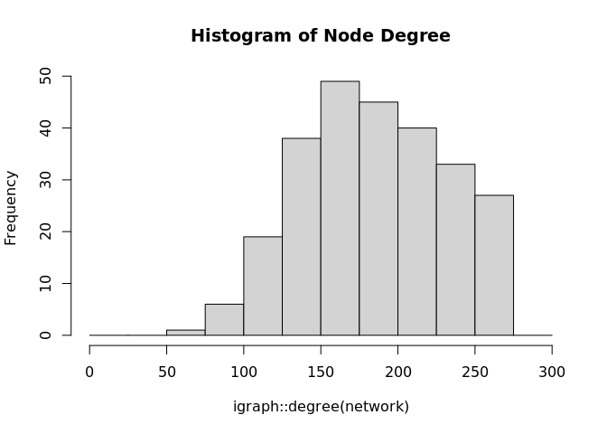
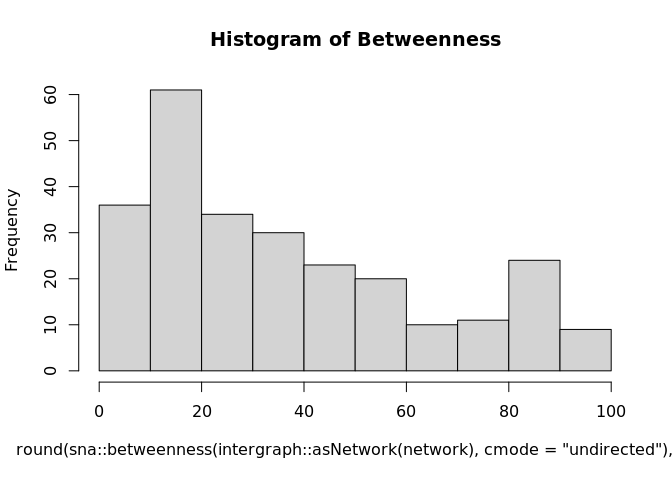

Load packages

    library(dplyr)
    library(igraph)
    library(lubridate)

Load data frame and filter for residence AND workplace within Fairfax
County.

    data <- read.csv("/sfs/qumulo/qhome/sm9dv/dspg20fairfax/data/od/jobsall.csv")

    # focus on within county first
    data <- data %>% 
      filter(grepl("^51059.+", w_geocode_tract) & grepl("^51059.+", h_geocode_tract))

Edge List
=========

Create edge list, which defines the "from" and "to" relationships of the
Fairfax workforce. We define "from" as residence and "to" as workplace.
For this script, we will define the weight as S000, which is the total
number of jobs, in other words,the total number of jobs for which a
worker lives in the "from" Census tract and commutes to the workplace in
the "to" Census tract (check interpretation).

    edgelist <- data %>% 
      select(h_geocode_tract, w_geocode_tract, S000) %>% 
      rename(from = h_geocode_tract, to = w_geocode_tract, weight = S000) %>% 
      group_by(from, to) %>% 
      summarize(weight = sum(weight)) %>% 
      arrange(-weight)

Next, we create the **igraph** network object. Simple graphs are graphs
which do not contain loop and multiple edges. The function below keeps
the loops, which would indicate working and living in the same tract,
but removes multiple edges, because we will start wth a simple, directed
graph.

    network <- simplify(graph.data.frame(edgelist, directed = TRUE), 
                             remove.loops = FALSE, 
                             edge.attr.comb = igraph_opt("edge.attr.comb"))
    is_weighted(network)

    ## [1] TRUE

    is_directed(network)

    ## [1] TRUE

    #D: directed
    #N: Named
    #W: Weighted

    print(network)

    ## IGRAPH b9e929c DNW- 258 32620 -- 
    ## + attr: name (v/c), weight (e/n)
    ## + edges from b9e929c (vertex names):
    ##  [1] 51059480202->51059480202 51059480202->51059482501 51059480202->51059460502
    ##  [4] 51059480202->51059461602 51059480202->51059490103 51059480202->51059471202
    ##  [7] 51059480202->51059482601 51059480202->51059490101 51059480202->51059471301
    ## [10] 51059480202->51059461601 51059480202->51059461100 51059480202->51059471100
    ## [13] 51059480202->51059492100 51059480202->51059491702 51059480202->51059492000
    ## [16] 51059480202->51059460400 51059480202->51059491201 51059480202->51059481106
    ## [19] 51059480202->51059482203 51059480202->51059482602 51059480202->51059440800
    ## [22] 51059480202->51059481202 51059480202->51059422102 51059480202->51059431001
    ## + ... omitted several edges

### Summary Statistics

Next, we will work through summary statistics of our network with
descriptions of each, in the context of the origin-destination data.

    network_stats <- data.frame(var="S000") 

##### Counts

The *order* of a graph indicates the number of nodes (or vertices). In
this case, the nodes are Census tracts.

    network_stats$node_count <- gorder(network)  
    print(network_stats$node_count )

    ## [1] 258

The *size* of graph indicates the number of edges (or links). Relevant
to OD data, the an edge represents a residence-workplace relationship
between Census tracts.

    network_stats$edge_count <- gsize(network)  
    print(network_stats$edge_count)

    ## [1] 32620

We can also add up the sum of weights for a count of jobs represented in
the graph.

    network_stats$jobs_count <- sum(edgelist$weight)
    print(network_stats$jobs_count)

    ## [1] 239741

The **degree** indicates the number of adjacent edges. An adjacent edge
shares a common vertex. In relation to the OD, the degree function
produces a count of links for each node, in this case, for each Census
tract. The average degree is printed.

    network_stats$mean_deg_total <- mean(igraph::degree(network))
    network_stats$mean_deg_out <- mean(igraph::degree(network, mode = "out"))
    network_stats$mean_deg_in <- mean(igraph::degree(network, mode = "in"))

    #mean(sna::degree(intergraph::asNetwork(network), cmode="freeman"))
    #mean(sna::degree(intergraph::asNetwork(network), cmode="indegree"))
    #mean(sna::degree(intergraph::asNetwork(network), cmode="outdegree"))

    knitr::kable(network_stats[, c("mean_deg_total", "mean_deg_out", "mean_deg_in")])

<table>
<thead>
<tr class="header">
<th align="right">mean_deg_total</th>
<th align="right">mean_deg_out</th>
<th align="right">mean_deg_in</th>
</tr>
</thead>
<tbody>
<tr class="odd">
<td align="right">252.8682</td>
<td align="right">126.4341</td>
<td align="right">126.4341</td>
</tr>
</tbody>
</table>

    hist(igraph::degree(network), breaks = seq(0,425, 25), main="Histogram of Node Degree")

**Betweenness** is a measure of centrality, which counts the number of
shortest paths (geodesic) going through a node.

    network_stats$mean_btw <- mean(round(sna::betweenness(intergraph::asNetwork(network), cmode="directed"), 4))

    print(network_stats$mean_btw)

    ## [1] 131.6938

    hist(round(sna::betweenness(intergraph::asNetwork(network), cmode="directed"), 4), main = "Histogram of Betweenness", breaks = seq(0, 500, 25))

##### Isolates, Dyads, and Triads

Isolates are non-connected nodes, which means either the workplace or
residence did not have a corresponding relationship.

    network_stats$isolates <- sum(igraph::degree(simplify(network))==0)

Triads

    network_stats$triads_003 <- igraph::triad.census(network)[1] # empty graph, no connections
    network_stats$triads_012 <- igraph::triad.census(network)[2]
    network_stats$triads_102 <- igraph::triad.census(network)[3] #graph with a mutual connection between two vertices.
    network_stats$triads_021D <- igraph::triad.census(network)[4]
    network_stats$triads_021U <- igraph::triad.census(network)[5]
    network_stats$triads_021C <- igraph::triad.census(network)[6]
    network_stats$triads_111D <- igraph::triad.census(network)[7]
    network_stats$triads_111U <- igraph::triad.census(network)[8]
    network_stats$triads_030T <- igraph::triad.census(network)[9]
    network_stats$triads_030C <- igraph::triad.census(network)[10]
    network_stats$triads_201 <- igraph::triad.census(network)[11] #graph with two mutual connection between two vertices.
    network_stats$triads_120D <- igraph::triad.census(network)[12]
    network_stats$triads_120U <- igraph::triad.census(network)[13]
    network_stats$triads_120C <- igraph::triad.census(network)[14]
    network_stats$triads_210 <- igraph::triad.census(network)[15]
    network_stats$triads_300 <- igraph::triad.census(network)[16] # complete graph

    knitr::kable(network_stats[, c(colnames(network_stats)[grepl("^triads_", colnames(network_stats))])][1:8])

<table>
<thead>
<tr class="header">
<th align="right">triads_003</th>
<th align="right">triads_012</th>
<th align="right">triads_102</th>
<th align="right">triads_021D</th>
<th align="right">triads_021U</th>
<th align="right">triads_021C</th>
<th align="right">triads_111D</th>
<th align="right">triads_111U</th>
</tr>
</thead>
<tbody>
<tr class="odd">
<td align="right">159438</td>
<td align="right">358305</td>
<td align="right">116240</td>
<td align="right">67378</td>
<td align="right">314441</td>
<td align="right">123361</td>
<td align="right">327796</td>
<td align="right">81845</td>
</tr>
</tbody>
</table>

    knitr::kable(network_stats[, c(colnames(network_stats)[grepl("^triads_", colnames(network_stats))])][9:16])

<table>
<thead>
<tr class="header">
<th align="right">triads_030T</th>
<th align="right">triads_030C</th>
<th align="right">triads_201</th>
<th align="right">triads_120D</th>
<th align="right">triads_120U</th>
<th align="right">triads_120C</th>
<th align="right">triads_210</th>
<th align="right">triads_300</th>
</tr>
</thead>
<tbody>
<tr class="odd">
<td align="right">239500</td>
<td align="right">12881</td>
<td align="right">84399</td>
<td align="right">298958</td>
<td align="right">80819</td>
<td align="right">113242</td>
<td align="right">314417</td>
<td align="right">136036</td>
</tr>
</tbody>
</table>

Dyads

Mutual Dyads are the count of pairs with mutual connections. Asymmetric
Dyads are the count of pairs with non-mutual connections. Null Dyads are
the count of pairs with no connections.

    network_stats$dyad_mut <- igraph::dyad_census(network)$mut
    network_stats$dyad_asym <- igraph::dyad_census(network)$asym
    network_stats$dyad_null <- igraph::dyad_census(network)$null

    knitr::kable(network_stats[, c(colnames(network_stats)[grepl("^dyad_", colnames(network_stats))])])

<table>
<thead>
<tr class="header">
<th align="right">dyad_mut</th>
<th align="right">dyad_asym</th>
<th align="right">dyad_null</th>
</tr>
</thead>
<tbody>
<tr class="odd">
<td align="right">8818</td>
<td align="right">14984</td>
<td align="right">9351</td>
</tr>
</tbody>
</table>

##### Density and Transitivity

The **diameter** of a graph is the length of the longest shortest path
(geodesic) passing through a node.

    network_stats$diameter <- diameter(network,directed=TRUE, 
                                       unconnected=if (network_stats$isolates == 0) {FALSE} else {TRUE})

Mean Distance: The average length of all the shortest paths from or to
the nodes in the network.

    network_stats$mean_distance <- mean_distance(network, directed = TRUE, 
                                       unconnected = if (network_stats$isolates == 0) {FALSE} else {TRUE})

Edge Density: ratio of the number of edges and the number of possible
edges. Density ranges from 0 (minimum) to 1 (maximum).

    network_stats$density <- edge_density(network, loops=TRUE) 
    print(network_stats$density)

    ## [1] 0.4900547

Transitivity: The probability that the adjacent vertices of a vertex are
connected

    network_stats$transitivity_global <- transitivity(network, weights = TRUE, type = "global")
    network_stats$transitivity_local_avg <- mean(transitivity(network, weights = TRUE, type = "local"))
    #network_stats$transitivity_barrat <- transitivity(network, weights = TRUE, type = "weighted") # weighted (this does not work)

    knitr::kable(network_stats[, c("transitivity_global", "transitivity_local_avg")])

<table>
<thead>
<tr class="header">
<th align="right">transitivity_global</th>
<th align="right">transitivity_local_avg</th>
</tr>
</thead>
<tbody>
<tr class="odd">
<td align="right">0.7821521</td>
<td align="right">0.4726695</td>
</tr>
</tbody>
</table>

### Community Detection

Louvain Method: The multi-level modularity optimization algorithm

    # this doesn't work for directed networks
    louvain <- igraph::cluster_louvain(as.undirected(network))
    network_stats$louvain <- modularity(louvain)
    network_stats$louvain_scaled <- modularity(louvain) / gorder(network)
    network_stats$louvain_logged <- modularity(louvain) / log(gorder(network))

    knitr::kable(network_stats[, c("louvain","louvain_scaled", "louvain_logged")])

<table>
<thead>
<tr class="header">
<th align="right">louvain</th>
<th align="right">louvain_scaled</th>
<th align="right">louvain_logged</th>
</tr>
</thead>
<tbody>
<tr class="odd">
<td align="right">0.1867802</td>
<td align="right">0.000724</td>
<td align="right">0.0336361</td>
</tr>
</tbody>
</table>

Fast and Greedy: searches for a dense sub-graph

    # does not work for directed graphs
    fstgrdy <- cluster_fast_greedy(as.undirected(network))
    network_stats$fstgrdy <- modularity(fstgrdy)
    network_stats$fstgrdy_scaled <- modularity(fstgrdy) / gorder(network)
    network_stats$fstgrdy_logged <- modularity(fstgrdy) / log(gorder(network))

    knitr::kable(network_stats[, c("fstgrdy","fstgrdy_scaled", "fstgrdy_logged")])

<table>
<thead>
<tr class="header">
<th align="right">fstgrdy</th>
<th align="right">fstgrdy_scaled</th>
<th align="right">fstgrdy_logged</th>
</tr>
</thead>
<tbody>
<tr class="odd">
<td align="right">0.1849842</td>
<td align="right">0.000717</td>
<td align="right">0.0333127</td>
</tr>
</tbody>
</table>

### Centrality

Degree Centrality: Centralize a graph according to the degrees of
vertices Closenses Centrality: Centralize a graph according to the
closeness of vertices Betweenness Centrality: Centralize a graph
according to the betweenness of vertices Eigenvector Centrality:
Centralize a graph according to the eigenvector centrality of vertices

    network_stats$centr_deg_total <- round(centr_degree(network, mode = "all")$centralization, 3)
    network_stats$centr_deg_out <- round(centr_degree(network, mode = "out")$centralization, 3)
    network_stats$centr_deg_in <- round(centr_degree(network, mode = "in")$centralization, 3)

    network_stats$centr_clo_total <- round(centr_clo(network, mode = "all")$centralization, 3)
    network_stats$centr_clo_out <- round(centr_clo(network, mode = "out")$centralization, 3)
    network_stats$centr_clo_in <- round(centr_clo(network, mode = "in")$centralization, 3)

    network_stats$centr_betw_total <- round(centr_betw(network, directed = TRUE)$centralization, 3)

    network_stats$centr_eigen_total <- round(centr_eigen(network, directed = TRUE)$centralization, 3)

### Decomposition Statistics

    decomposition_stats <- table(sapply(decompose.graph(network), vcount))

Nodelist
========

    nodelist <- data.frame(id = c(1:(igraph::vcount(network))), tract = igraph::V(network)$name)

### degree, weighted degree, k core and modularity

Degree Centrality and Weighted Degree Centrality (All/Out/In):

    nodelist$deg_cent_total <- igraph::degree(network, mode = "all")
    nodelist$deg_cent_out <- igraph::degree(network, mode = "out")
    nodelist$deg_cent_in <- igraph::degree(network, mode = "in")

    nodelist$wtd_deg_cent_total <- igraph::strength(network, mode = "all")
    nodelist$wtd_deg_cent_out <- igraph::strength(network, mode = "out")
    nodelist$wtd_deg_cent_in <- igraph::strength(network, mode = "in")

Betweeness Centrality:

    nodelist$btw_cent <- round(sna::betweenness(intergraph::asNetwork(network), cmode="directed"), 4)

Closeness Centrality (All/In/Out):

    nodelist$close_cent_total <- igraph::centr_clo(network, mode = "all")$res 
    nodelist$close_cent_out <- igraph::centr_clo(network, mode = "out")$res  
    nodelist$close_cent_in <- igraph::centr_clo(network, mode = "in")$res 

Eigenvector Centrality:

    nodelist$eigen_cent <- igraph::eigen_centrality(network, directed = TRUE)$vector

    ## Warning in igraph::eigen_centrality(network, directed = TRUE): At centrality.c:
    ## 362 :Weighted directed graph in eigenvector centrality

### Membership

    components <- components(network)
    fstgrdy <- fastgreedy.community(as.undirected(network))
    louvain <- cluster_louvain(as.undirected(network))

    nodelist$component <- components$membership
    nodelist$louvain_comm <- louvain$membership
    nodelist$fstgrdy_comm <- fstgrdy$membership

### Sources

<http://www.people.vcu.edu/~gasmerom/MAT131/graphs.html#>:~:text=Two%20vertices%20are%20said%20to,edge%20(arc)%20connecting%20them.&text=Adjacent%20edges%20are%20edges%20that%20share%20a%20common%20vertex.&text=The%20degree%20of%20a%20vertex,edges%20incident%20with%20that%20vertex.&text=A%20graph%20is%20said%20to,are%20joined%20by%20a%20path.

<https://github.com/uva-bi-sdad/oss-2020/blob/master/src/github-network-analysis/02_international-collaboration/03_country-networks/03_ctry-nets-cum-analysis.Rmd>

<https://www.jessesadler.com/post/network-analysis-with-r/>

<https://kateto.net/wp-content/uploads/2018/03/R%20for%20Networks%20Workshop%20-%20Ognyanova%20-%202018.pdf>

<https://kateto.net/network-visualization>

<https://ebookcentral-proquest-com.proxy01.its.virginia.edu/lib/uva/reader.action?docID=4199226&ppg=185>

<https://lehd.ces.census.gov/data/lodes/LODES7/LODESTechDoc7.4.pdf>

<https://igraph.org/r/doc/igraph.pdf>
